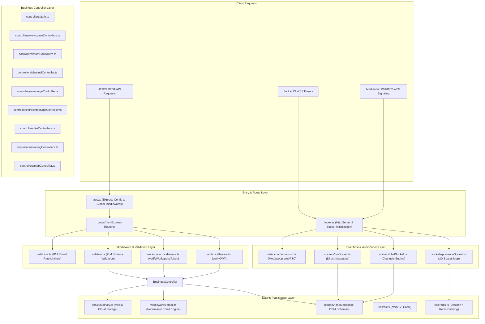
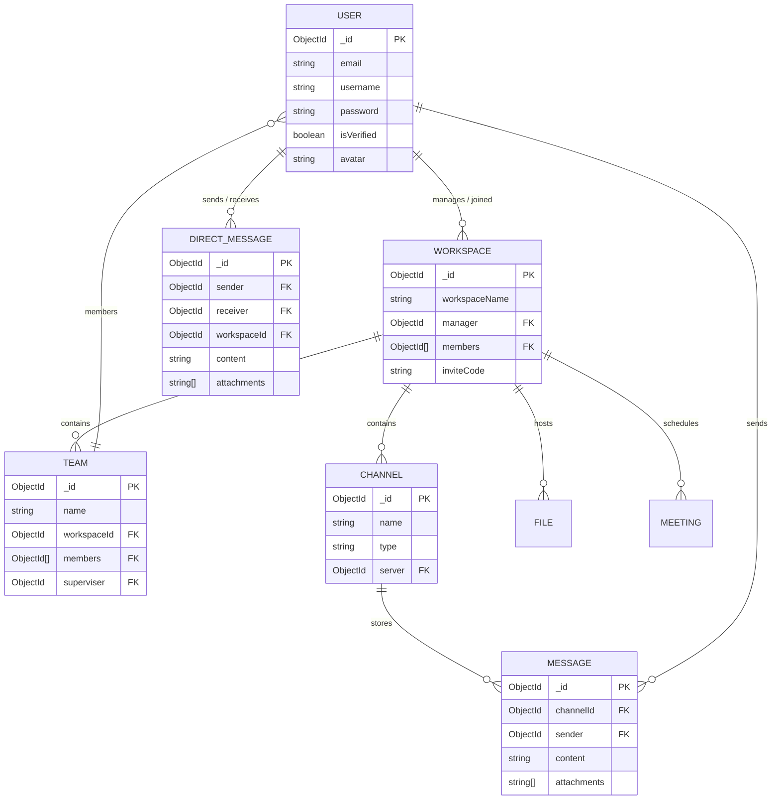

# VOW Backend - Technical Architecture & Infrastructure Specification

## 1. Executive Summary

**VOW Backend** is a high-performance, event-driven Node.js & Express application written in TypeScript. It powers real-time spatial avatar synchronization, persistent channels & direct messaging, SFU WebRTC signaling, role-based workspace management, meeting scheduling with automated email alerts, and secure multi-cloud file vault storage.

---

## 2. Layered Software Architecture

The backend follows a **Clean Layered Architecture** separating routing, request validation, business logic, data persistence, and real-time event distribution:

---

## 3. Database Schemas & Data Model Relationships

---

## 4. Key Infrastructure Services Specifications

1. **Database Persistence**: MongoDB Atlas Cluster via Mongoose ODM. Schema validation, password hashing pre-save hooks (`bcryptjs`), and token generation methods.
2. **Real-Time WebSockets**: Socket.IO server with custom token authentication handshakes. Emits real-time spatial movements, channel messages, and direct messages.
3. **WebRTC SFU Conferencing**: Powered by Mediasoup Node.js library. Configured for low-latency multi-participant audio/video routing over WebSockets signaling.
4. **Cloud Vault Storage**: Hybrid file storage supporting Cloudinary CDN and AWS S3 bucket storage with Base64 fallback handling.
5. **Nodemailer Email Engine**: Sends OTP verification codes, welcome emails, workspace invitations, and meeting cancellation/reschedule alerts using HTML email templates.
