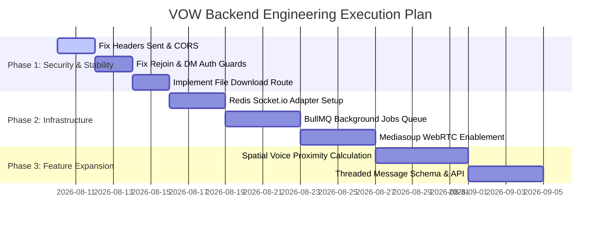

# VOW Backend - Architectural Suggestions & Actionable Roadmap

This document presents a structured plan for upgrading the **VOW Backend** system for performance, security, and scalability.

---

## 1. System Architecture Refactoring Suggestions

### 1.1 Multi-Node Redis Socket.IO Adapter
- **Goal**: Enable horizontal scaling across multiple backend server containers.
- **Action**: Integrate `@socket.io/redis-adapter` with `ioredis` client so Socket.IO events (`move`, `receive_message`, `receive_dm`) propagate across all Node.js cluster processes seamlessly.

---

### 1.2 Durable Background Job Queue (BullMQ)
- **Goal**: Replace in-memory `setTimeout` calendar email reminders with persistent job scheduling.
- **Action**: Implement a BullMQ worker queue powered by Redis to handle meeting reminder emails, daily unverified user cleanup, and heavy report generations reliably.

---

### 1.3 AWS S3 Presigned Direct Uploads
- **Goal**: Offload heavy binary file traffic from the Node.js Express server to AWS S3.
- **Action**: Replace multipart file POST endpoints with a GET endpoint `/files/:workspaceId/presigned-url` returning signed S3 PUT URLs. The client browser uploads directly to S3.

---

## 2. Recommended New Features to Implement

1. **Spatial Proximity Audio Engine**: Calculate Euclidean avatar distance $d = \sqrt{(x_2-x_1)^2 + (y_2-y_1)^2}$ on position updates. Trigger audio gain changes or auto-connect spatial voice channels when avatars come within 5 grid units.
2. **Channel Threads & Reactions**: Add `parentId` to `Message` model for threaded discussion, and `reactions` array (`{ emoji: string, users: ObjectId[] }`) for message emoji reactions.
3. **Audit Trail Logging**: Create an `AuditLog` collection tracking administrative actions (member removals, role updates, workspace deletion, channel renames).

---

## 3. Step-by-Step Implementation Phase Plan

