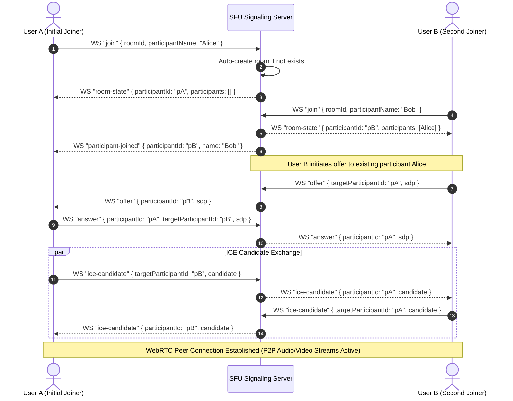

# VOW Backend & Frontend - Videochat Subsystem Analysis & Fixes Guide

## 1. Executive Summary

This document provides a technical root-cause analysis of why **Audio/Video Calls and Group Video Conferencing** are failing in the VOW platform despite text chat messaging and 2D spatial movement functioning properly.

The video calling subsystem uses a WebSockets-based WebRTC signaling system located in `VOW_backend/src/videochat/` paired with the frontend hook `useSfuVideoCall.js` and signaling client `sfuSignaling.js`.

---

## 2. Root Cause Analysis Matrix

| # | Flaw / Root Cause | Location | Impact | Severity |
| :--- | :--- | :--- | :--- | :--- |
| **1** | **Videochat Server Disabled on Boot** | `VOW_backend/src/index.ts#L23` | Line 23 `// await initVideoChat(app, server);` is commented out. Signaling server at `/signaling` never starts. | **CRITICAL** |
| **2** | **Room Auto-Creation Failure** | `VOW_backend/src/videochat/server/sfu.ts#L184` | `handleJoin` returns `null` if room was not pre-created via HTTP API. Server responds with `"Failed to join room"`. | **CRITICAL** |
| **3** | **Missing `participant-joined` Event Handler** | `VOW/src/components/chat/useSfuVideoCall.js` | Existing participants are never notified when new members join the room, blocking WebRTC offer creation. | **CRITICAL** |
| **4** | **React Closure Stale State Bug** | `VOW/src/components/chat/useSfuVideoCall.js#L167` | `participantId` is `null` when `sendAnswer` is invoked, causing signaling payload to carry invalid sender ID. | **HIGH** |
| **5** | **ICE Candidate Race Condition** | `VOW/src/components/chat/useSfuVideoCall.js#L191` | Candidates arriving before `setRemoteDescription()` complete throw `InvalidStateError` and get dropped. | **HIGH** |
| **6** | **Lack of TURN Relay Server** | `VOW/src/components/chat/useSfuVideoCall.js#L43` | Connection uses STUN only; fails across firewalls and symmetric NAT networks (20-30% of users). | **MEDIUM** |
| **7** | **Signaling Transport Protocol Confusion** | `videochat/server/websocket.ts` & `sfu.ts` | Backend contains legacy binary chunk streaming logic (`0x00 0x00`) mixed with WebRTC P2P SDP signaling. | **MEDIUM** |

---

## 3. Detailed Technical Analysis of Each Root Cause

### 3.1 Root Cause #1: Backend Videochat Engine Disabled on Server Boot
- **Location**: `VOW_backend/src/index.ts`
- **Code Inspection**:
  ```typescript
  // Line 23 of src/index.ts
  // await initVideoChat(app, server);
  ```
- **Analysis**: The Express server boots without initializing the `WebSocketSignalingServer` instance on HTTP route `/signaling`.
- **Symptom**: When a user clicks "Join Audio/Video Call", `SfuSignalingClient` attempts to connect to `ws://localhost:8000/signaling` or `wss://vow-backend.me/signaling`. The connection fails instantly with `WebSocket connection to '...' failed: Error during WebSocket handshake: 404 Not Found` or `ECONNREFUSED`.

---

### 3.2 Root Cause #2: Room Auto-Creation Failure in `sfu.ts`
- **Location**: `VOW_backend/src/videochat/server/sfu.ts#L184`
- **Code Inspection**:
  ```typescript
  handleJoin(roomId: string, participantName: string, socket: WebSocket) {
    const room = this.rooms.get(roomId);
    if (!room) {
      logger.warn(`Room ${roomId} not found`);
      return null; // <--- FAILS HERE if room was not pre-created via HTTP POST /videochat/rooms!
    }
    ...
  }
  ```
- **Analysis**: When a user enters a workspace channel or clicks to start a call, the frontend sends a WebSocket `join` message with `roomId = channelId` or `roomId = workspaceId`. Because no HTTP request was made to pre-create the room in `sfuServer.rooms` Map, `this.rooms.get(roomId)` evaluates to `undefined`.
- **Symptom**: `websocket.ts` line 180 sends `{ type: "error", data: { message: "Failed to join room" } }`. The user cannot enter the call room.

---

### 3.3 Root Cause #3: Missing `participant-joined` Handler in Frontend
- **Location**: `VOW/src/components/chat/useSfuVideoCall.js`
- **Analysis**:
  1. When User A is in a call room and User B joins, backend `sfu.ts` broadcasts `SignalingMessageType.PARTICIPANT_JOINED` (`"participant-joined"`) to User A.
  2. However, `useSfuVideoCall.js` ONLY listens to `room-state`, `offer`, `answer`, and `ice-candidate`.
  3. `useSfuVideoCall.js` has **NO listener** for `participant-joined`!
- **Symptom**: User A (who is already in the call) is never informed that User B joined. User A never creates a PeerConnection or SDP offer to User B. Group video mesh topology breaks completely for multi-user calls.

---

### 3.4 Root Cause #4: React Closure Stale State Bug (`participantId: null`)
- **Location**: `VOW/src/components/chat/useSfuVideoCall.js#L167`
- **Code Inspection**:
  ```javascript
  s.on("offer", async (msg) => {
    ...
    signalingRef.current.sendAnswer(msg.roomId, participantId, from, ans); // <--- participantId is NULL!
  });
  ```
- **Analysis**: `registerHandlers` is defined inside a `useCallback` hook. When `registerHandlers` executes upon WebSocket connection, the React state `participantId` is initially `null`. State setters in React are asynchronous. The captured closure inside `s.on("offer")` retains `participantId = null`.
- **Symptom**: When User B receives an offer from User A, User B sends an answer payload with `participantId: null`. The signaling server cannot route the answer back to User A, causing the WebRTC connection state to remain stuck in `connecting` or `failed`.

---

### 3.5 Root Cause #5: ICE Candidate Race Condition
- **Location**: `VOW/src/components/chat/useSfuVideoCall.js#L191`
- **Analysis**: WebRTC ICE candidates are generated asynchronously by the browser network stack as soon as `createOffer` or `createAnswer` is called. ICE candidates are transmitted over WebSockets immediately. Frequently, ICE candidates arrive at the receiver before `setRemoteDescription()` completes.
- **Symptom**: `pc.addIceCandidate()` throws `DOMException: Failed to execute 'addIceCandidate' on 'RTCPeerConnection': The remote description was null`. Candidates are permanently lost, causing peer connections to fail ICE gathering phase.

---

## 4. Correct Signaling Sequence Flow



---

## 5. Step-by-Step Implementation Fixes

### Fix 1: Re-Enable `initVideoChat` in `VOW_backend/src/index.ts`

```typescript
// VOW_backend/src/index.ts
import { initVideoChat } from "./videochat/init";

async function startServer() {
  try {
    await mongoDb();
    const server = http.createServer(app);

    // Initialize Socket.IO
    const io = initSocket(server);

    // Initialize SFU WebRTC Signaling Server
    await initVideoChat(app, server);

    server.listen(PORT, () => {
      console.log(`Server running at http://localhost:${PORT}`);
    });
    ...
```

---

### Fix 2: Auto-Create Room on Join in `VOW_backend/src/videochat/server/sfu.ts`

```typescript
// VOW_backend/src/videochat/server/sfu.ts (Update handleJoin)
handleJoin(
  roomId: string,
  participantName: string,
  socket: WebSocket
): { participantId: string; roomState: any } | null {
  let room = this.rooms.get(roomId);
  
  // Auto-create room if it doesn't exist yet
  if (!room) {
    logger.info(`[SFU:${process.pid}] Room ${roomId} not found during join -> Auto-creating room`);
    room = new RoomManager(roomId, `Room-${roomId}`);
    this.rooms.set(roomId, room);
    this.roomCreatedAt.set(roomId, Date.now());
  }

  if (!room.canJoin()) {
    logger.warn(`Room ${roomId} is full`);
    return null;
  }

  const participantId = uuidv4();
  const participant: Participant = {
    id: participantId,
    roomId,
    name: participantName,
    joinedAt: Date.now(),
    isPublishing: false,
    streams: { video: false, audio: false }
  };

  const manager = new ParticipantManager(participant, socket);
  room.addParticipant(manager);

  // Broadcast participant-joined to existing participants
  const joinMessage = Protocol.createMessage(
    SignalingMessageType.PARTICIPANT_JOINED,
    roomId,
    participantId,
    { participant: manager.toJSON() }
  );
  room.broadcastMessage(joinMessage, participantId);

  return {
    participantId,
    roomState: room.getRoomState()
  };
}
```

---

### Fix 3: Correct Handlers & Candidate Queue in `VOW/src/components/chat/useSfuVideoCall.js`

```javascript
// Updated useSfuVideoCall.js with Candidate Queue & participant-joined handler
import { useCallback, useEffect, useRef, useState } from "react";
import SfuSignalingClient from "./sfuSignaling.js";

export const useSfuVideoCall = () => {
  const signalingRef = useRef(null);
  const peersRef = useRef(new Map());
  const candidateQueuesRef = useRef(new Map()); // Queue ICE candidates arriving before remote description
  const participantIdRef = useRef(null);

  const [roomId, setRoomId] = useState(null);
  const [participantId, setParticipantId] = useState(null);
  const [localStream, setLocalStream] = useState(null);
  const [remoteStreams, setRemoteStreams] = useState(new Map());

  const ensureSignaling = useCallback(async () => {
    if (signalingRef.current) return signalingRef.current;
    const s = new SfuSignalingClient();
    await s.connect();
    signalingRef.current = s;
    return s;
  }, []);

  const ensureLocalMedia = useCallback(async () => {
    if (localStream) return localStream;
    const s = await navigator.mediaDevices.getUserMedia({ audio: true, video: true });
    setLocalStream(s);
    return s;
  }, [localStream]);

  const processCandidateQueue = async (peerId, pc) => {
    const queue = candidateQueuesRef.current.get(peerId) || [];
    while (queue.length > 0) {
      const candidate = queue.shift();
      try {
        await pc.addIceCandidate(candidate);
      } catch (err) {
        console.error("[SFU] Error processing queued candidate:", err);
      }
    }
  };

  const createPeer = useCallback((peerId, currentRoomId) => {
    if (peersRef.current.has(peerId)) return peersRef.current.get(peerId);

    const pc = new RTCPeerConnection({
      iceServers: [
        { urls: "stun:stun.l.google.com:19302" },
        { urls: "stun:stun1.l.google.com:19302" },
        { urls: "stun:stun2.l.google.com:19302" }
      ],
    });

    pc.onicecandidate = (e) => {
      if (e.candidate && signalingRef.current) {
        signalingRef.current.sendIceCandidate(
          currentRoomId || roomId,
          participantIdRef.current,
          peerId,
          e.candidate
        );
      }
    };

    pc.ontrack = (e) => {
      const stream = e.streams?.[0] || new MediaStream([e.track]);
      setRemoteStreams((prev) => {
        const m = new Map(prev);
        m.set(peerId, stream);
        return m;
      });
    };

    peersRef.current.set(peerId, pc);
    return pc;
  }, [roomId]);

  const registerHandlers = useCallback((s, currentRoomId) => {
    s.on("room-state", async (msg) => {
      setParticipantId(msg.participantId);
      participantIdRef.current = msg.participantId;
      s.participantId = msg.participantId;

      const media = await ensureLocalMedia();

      for (const p of msg.data.participants) {
        if (p.id === msg.participantId) continue;

        const pc = createPeer(p.id, currentRoomId);
        media.getTracks().forEach((track) => pc.addTrack(track, media));

        const offer = await pc.createOffer();
        await pc.setLocalDescription(offer);

        signalingRef.current.sendOffer(currentRoomId, msg.participantId, p.id, offer);
      }
    });

    s.on("participant-joined", async (msg) => {
      const newPeerId = msg.data?.participant?.id;
      if (!newPeerId || newPeerId === participantIdRef.current) return;

      const media = await ensureLocalMedia();
      const pc = createPeer(newPeerId, currentRoomId);
      media.getTracks().forEach((track) => pc.addTrack(track, media));

      const offer = await pc.createOffer();
      await pc.setLocalDescription(offer);

      signalingRef.current.sendOffer(currentRoomId, participantIdRef.current, newPeerId, offer);
    });

    s.on("offer", async (msg) => {
      const from = msg.participantId;
      const pc = createPeer(from, currentRoomId);
      const media = await ensureLocalMedia();

      media.getTracks().forEach((track) => pc.addTrack(track, media));

      await pc.setRemoteDescription({ type: msg.data.type, sdp: msg.data.sdp });
      await processCandidateQueue(from, pc);

      const ans = await pc.createAnswer();
      await pc.setLocalDescription(ans);

      signalingRef.current.sendAnswer(currentRoomId, participantIdRef.current, from, ans);
    });

    s.on("answer", async (msg) => {
      const pc = peersRef.current.get(msg.participantId);
      if (!pc) return;

      await pc.setRemoteDescription({ type: msg.data.type, sdp: msg.data.sdp });
      await processCandidateQueue(msg.participantId, pc);
    });

    s.on("ice-candidate", async (msg) => {
      const pc = peersRef.current.get(msg.participantId);
      const candidateInit = {
        candidate: msg.data.candidate,
        sdpMid: msg.data.sdpMid,
        sdpMLineIndex: msg.data.sdpMLineIndex,
      };

      if (pc && pc.remoteDescription && pc.remoteDescription.type) {
        try {
          await pc.addIceCandidate(candidateInit);
        } catch (err) {
          console.error("[SFU] Error adding ICE candidate:", err);
        }
      } else {
        if (!candidateQueuesRef.current.has(msg.participantId)) {
          candidateQueuesRef.current.set(msg.participantId, []);
        }
        candidateQueuesRef.current.get(msg.participantId).push(candidateInit);
      }
    });
  }, [createPeer, ensureLocalMedia]);

  const join = useCallback(async (rid, name) => {
    setRoomId(rid);
    const s = await ensureSignaling();
    registerHandlers(s, rid);
    await ensureLocalMedia();
    s.join(rid, name);
  }, [ensureSignaling, registerHandlers, ensureLocalMedia]);

  const leave = () => {
    peersRef.current.forEach((pc) => pc.close());
    peersRef.current.clear();
    candidateQueuesRef.current.clear();
    setRemoteStreams(new Map());

    if (localStream) localStream.getTracks().forEach((t) => t.stop());

    setLocalStream(null);
    setRoomId(null);
    setParticipantId(null);
    participantIdRef.current = null;
  };

  return { roomId, participantId, localStream, remoteStreams, join, leave };
};

export default useSfuVideoCall;
```

---

## 6. Verification Checklist

- [ ] **Step 1**: Re-enable `initVideoChat(app, server)` in `VOW_backend/src/index.ts`.
- [ ] **Step 2**: Apply room auto-creation patch in `VOW_backend/src/videochat/server/sfu.ts`.
- [ ] **Step 3**: Update `useSfuVideoCall.js` with candidate queue, `participant-joined` listener, and `participantIdRef` fix.
- [ ] **Step 4**: Test 2-user video call: User A joins room `room-1`, User B joins `room-1`. Verify video feeds and audio tracks exchange successfully on both clients.
- [ ] **Step 5**: Test 3-user group video call: User C joins `room-1`. Verify User C sees feeds from User A and User B, and User A and B see User C.
